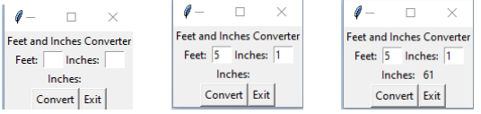

## GUI - Feet & Inches to Inches

### Instructions:
 
- Create a GUI program that contains entry objects where the user can enter values for feet and inches. They should then be able to click a button and have the feet and inches entered converted to a single inches value. 
  - Code for the GUI should be contained in a class 
  - The GUI should contain labels that briefly describe the program and all input and output 
  - The GUI should contain a button that  ends the program when clicked
- Enter your name, the lab number, and the current date into a set of comments at the top of the code.	
- Push the program source code to the assignment repo. 

### Example Output

### Grading:
General, compiles, comments, proper indentation, etc  
Labels  
Input  
Buttons  
Data conversion and output 
